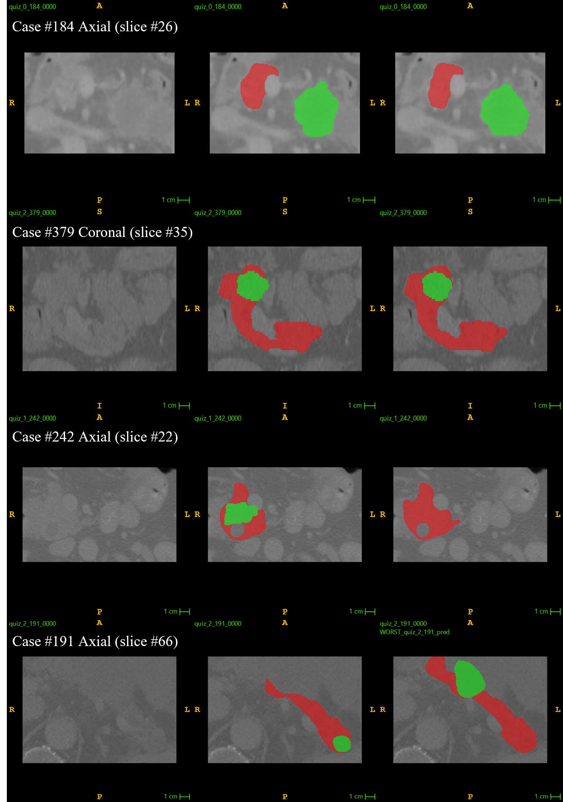

# Deep Learning for Automatic Cancer Segmentation and Classification in 3D CT Scans

This repository contains the implementation for the coding test **"Deep Learning for Automatic Cancer Segmentation and Classification in 3D CT Scans"**. The method is a multi-task deep learning framework built upon [nnU-Net v2](https://github.com/MIC-DKFZ/nnUNet) that simultaneously performs pancreas/lesion segmentation and lesion subtype classification from 3D CT volumes.

**Author:** Keishi Suzuki — University of Toronto  
**Repository:** [https://github.com/Kappapapa123/ML-Quiz-3DMedImg](https://github.com/Kappapapa123/ML-Quiz-3DMedImg)

---

## Architecture

The framework uses a **shared 3D U-Net encoder** (six stages, channels 32→64→128→256→320→320) with two task-specific heads:

1. **Segmentation Decoder** — Standard nnU-Net decoder with skip connections, transpose convolutions, and a 1×1×1 conv layer producing voxel-wise logits for background, pancreas, and lesion.
2. **Cross-Attention Pooling Classification Head** — Branches off the encoder bottleneck. The bottleneck feature map is reshaped into spatial tokens, and a set of learnable query tokens attends to them via multi-head attention. The resulting fixed-size representation is passed through LayerNorm and a linear layer to output logits for 3 lesion subtypes.

**Loss function:**

$$\mathcal{L} = \mathcal{L}_{\text{Dice+CE}}^{\text{seg}} + \lambda_{\text{cls}} \cdot \mathcal{L}_{\text{wCE}}^{\text{cls}}$$

where $\lambda_{\text{cls}} = 0.1$ down-weights the classification loss, and $\mathcal{L}_{\text{wCE}}^{\text{cls}}$ uses inverse-frequency class weights to address subtype imbalance.

---

## Requirements

### Environment

| Component | Specification |
|---|---|
| System | Windows 11 |
| CPU | Intel Core i7-14650HX (2.20 GHz) |
| RAM | 32 GB (16×2, 5600 MT/s) |
| GPU | NVIDIA GeForce RTX 4070 Laptop GPU (8 GB) |
| CUDA | 11.8 |
| Python | 3.12.11 |
| PyTorch | 2.7.1+cu118 |

### Installation

```bash
# Install PyTorch with CUDA 11.8
pip install torch torchvision --index-url https://download.pytorch.org/whl/cu118

# Install all other dependencies
pip install -r requirements.txt
```

Key dependencies: `nnunetv2==2.6.4`, `nibabel`, `blosc2`, `MetricsReloaded`, `wandb`, `scikit-learn`.

---

## Dataset

The dataset consists of de-identified 3D pancreatic CT scans cropped to regions of interest (ROIs) around the pancreas. Each scan has:
- **Segmentation labels:** 0 = background, 1 = normal pancreas, 2 = pancreatic lesion
- **Classification label:** subtype 0, 1, or 2

| Split | Total | Subtype 0 | Subtype 1 | Subtype 2 |
|---|---|---|---|---|
| Train | 252 | 62 | 106 | 84 |
| Validation | 36 | 9 | 15 | 12 |
| Test | 72 | — | — | — |

No additional public datasets or pre-trained weights were used.

### Data Preparation

1. Organize data following the [nnU-Net dataset format](https://github.com/MIC-DKFZ/nnUNet/blob/master/documentation/dataset_format.md) under `nnUNet_storage/nnUNet_raw/Dataset001_Pancreas/`.
2. Run label rounding (required for nnU-Net fingerprint extraction):
   ```bash
   python round_label.py
   ```
3. Create the train/val split:
   ```bash
   python create_split_json.py
   ```
4. Set nnU-Net environment variables:
   ```bash
   set nnUNet_raw=<project_root>/nnUNet_storage/nnUNet_raw
   set nnUNet_preprocessed=<project_root>/nnUNet_storage/nnUNet_preprocessed
   set nnUNet_results=<project_root>/nnUNet_storage/nnUNet_results
   ```
5. Run nnU-Net preprocessing:
   ```bash
   nnUNetv2_plan_and_preprocess -d 001 --verify_dataset_integrity
   ```

---

## Training

The custom multi-task trainer (`nnUNetTrainerMultitask.py`) must be placed in the nnU-Net trainer directory so it is discovered at runtime:

```
<python_env>/Lib/site-packages/nnunetv2/training/nnUNetTrainer/nnUNetTrainerMultitask.py
```

Then train with:

```bash
nnUNetv2_train 001 3d_fullres 0 -tr nnUNetTrainerMultiTask
```

### Training Protocol

| Parameter | Value |
|---|---|
| Network initialization | Default (nnU-Net v2 / PyTorch) |
| Batch size | 3 |
| Patch size | 64 × 128 × 192 |
| Total epochs | 700 |
| Optimizer | SGD (Nesterov, μ = 0.99, weight decay 3×10⁻⁵) |
| Initial learning rate | 0.01 |
| LR schedule | Polynomial decay |
| Classification loss weight (λ_cls) | 0.1 |
| Gradient clipping | Max norm 12 |
| Classification head dropout | 0.3 |
| Training time | ~44 hours |

Data augmentation follows the nnU-Net v2 default pipeline (rotation, scaling, elastic deformation, mirroring, gamma, brightness/contrast, Gaussian noise) with ~33% foreground oversampling.

---

## Evaluation

### Run validation evaluation

```bash
python evaluate.py
```

This computes segmentation metrics (DSC, NSD, Fβ) and classification metrics (Macro-F1, Balanced Accuracy, LR+, calibration) on the 36 validation cases.

### Run full evaluation + test inference pipeline

```bash
python run_evaluation_and_inference.py
```

This script:
1. Generates `validation_results.csv` (per-case segmentation + classification results)
2. Copies best/worst masks for the qualitative report
3. Runs segmentation inference on the test set → `Keishi_Suzuki_results/`
4. Runs classification inference on the test set → `Keishi_Suzuki_results/subtype_results.csv`

### Measure inference efficiency

```bash
python measure_efficiency.py
```

Reports per-case running time, max GPU memory, and total GPU usage (area under GPU-time curve).

---

## Results

### Segmentation Performance (Validation, N=36)

| Region | DSC | NSD (τ=1mm) | Fβ (β=2) |
|---|---|---|---|
| Whole Pancreas | 0.933 ± 0.040 | 0.848 ± 0.105 | 0.932 ± 0.037 |
| Lesion | 0.662 ± 0.303 | 0.464 ± 0.277 | 0.654 ± 0.302 |

### Classification Performance (Validation, N=36)

| Macro-F1 | Balanced Accuracy | LR+ (class 0) | LR+ (class 1) | LR+ (class 2) | ECE_KDE | CWCE | RBS |
|---|---|---|---|---|---|---|---|
| 0.617 | 0.617 | 6.000 | 4.200 | 1.750 | 0.380 | 0.239 | 0.823 |

### Qualitative Results



Images in each row in order from left: original image, ground truth mask, and predicted mask.

**Top two rows:** Strong performance — whole pancreas (red) and lesion (green) match ground truth.  
**Bottom two rows:** Failure cases — missed lesion (small volume) and incorrect lesion localization.

---

## Repository Structure

```
ML-Quiz-3DMedImg/
├── nnUNetTrainerMultitask.py     # Custom multi-task trainer (core contribution)
├── evaluate.py                    # Validation metrics computation
├── run_evaluation_and_inference.py # Full eval + test inference pipeline
├── measure_efficiency.py          # Inference efficiency benchmarking
├── create_split_json.py           # Train/val split generation
├── round_label.py                 # Label preprocessing for nnU-Net
├── convert_masks_for_itksnap.py   # Mask format conversion for visualization
├── requirements.txt               # Python dependencies
├── .gitignore
├── validation_results.csv         # Per-case validation results
├── subtype_results.csv            # Test set classification predictions
├── Keishi_Suzuki_results/         # Test set outputs
│   └── subtype_results.csv
├── qualitative_report.png         # Qualitative segmentation figure
└── README.md
```

---

## Acknowledgements

The segmentation method implemented for this coding test has not used any pre-trained models nor additional datasets other than those provided by the organizers. The proposed solution is fully automatic without any manual intervention.

## References

1. Cao, K., et al. "Large-scale pancreatic cancer detection via non-contrast ct and deep learning." *Nature Medicine* 29, 3033-3043 (2023).
2. Isensee, F., et al. "nnU-Net: a self-configuring method for deep learning-based biomedical image segmentation." *Nature Methods* 18(2), 203–211 (2021).
3. Ma, J., et al. "Loss odyssey in medical image segmentation." *Medical Image Analysis* 71, 102035 (2021).
4. Maier-Hein, L., et al. "Metrics Reloaded: recommendations for image analysis validation." *Nature Methods* 21, 195–212 (2024).
5. National Cancer Institute. "SEER Cancer Stat Facts: Pancreatic Cancer." [https://seer.cancer.gov/statfacts/html/pancreas.html](https://seer.cancer.gov/statfacts/html/pancreas.html).
6. Shi, P., et al. "2nd Place Solution: RSNA Intracranial Aneurysm Detection." Kaggle competition write-up (2025).
